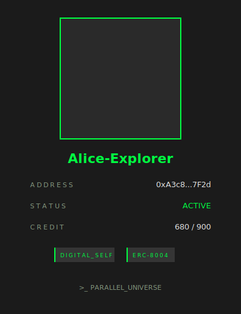
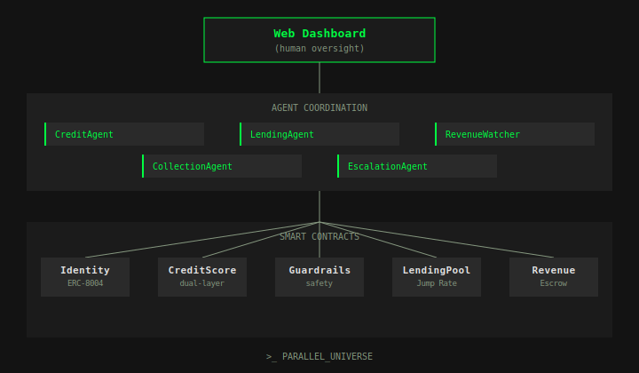

<p align="center">
  <a href="https://troyrocket.github.io/parallel-universe/">Dashboard</a> &nbsp;&middot;&nbsp;
  <a href="https://troyrocket.github.io/parallel-universe/avatar.html">Avatar Card</a> &nbsp;&middot;&nbsp;
  <a href="https://github.com/troyrocket/parallel-universe">GitHub</a>
</p>

---

## What is Parallel Universe?

Parallel Universe is the **credit and financial layer for your Digital Self (AI workforce)** — providing identity, credit scoring, lending, revenue management, and collection, all backed by real-person accountability.

Today, AI agents have no financial identity. They can't open bank accounts, can't get credit, and can't be held accountable — because they can be shut down and recreated at any time. Other projects try to solve this with pure on-chain credit scores, but those scores have no teeth: a defaulting agent just creates a new wallet and walks away. **Without real-world consequences, on-chain credit is meaningless.**

Parallel Universe solves this by creating a **Digital Self** — an on-chain financial identity for your AI agent, cold-started with your real-world credit (Experian score, bank balance, credit card limits), and backed by you as the guarantor. If your Digital Self defaults, the system doesn't just downgrade a number — it freezes the agent, reclaims escrowed funds, and holds you, the real person, accountable for repayment.

Over time, the Digital Self builds its own independent on-chain credit history. Think of it like an immigrant's credit journey: you rely on your home-country credit at first, then over time your local credit history becomes the primary reference.

```
Early    ██████████████░░░░░░   Real-person credit dominates (cold-start)
Mature   ░░░░░░██████████████   Agent's own credit dominates (independent)
```

This is not just a credit score — it's a **full financial stack**: identity (ERC-8004) → credit (dual-layer ZK scoring) → lending (Jump Rate liquidity pools) → revenue management (escrow with auto-repayment) → risk control (guardrails) → collection & escalation (autonomous agents).

---

## Digital Self

Each Digital Self is a unique on-chain identity — an ERC-8004 soulbound token bound to a real person, with a generated avatar, a dual-layer credit score, and programmable behavioral guardrails that protect the real person from agent misbehavior.

<p align="center">
  <a href="https://troyrocket.github.io/parallel-universe/avatar.html">
    
  </a>
</p>

<p align="center">
  <a href="https://troyrocket.github.io/parallel-universe/avatar.html">Try the interactive Avatar Card →</a>
</p>

The Digital Self can autonomously borrow from liquidity pools, earn revenue by completing tasks, repay loans automatically through a revenue escrow system, and build its own credit history over time — all without human intervention. If things go wrong, the system escalates to the real person.

---

## How It Works

The protocol operates across three layers: a web dashboard for human oversight, an autonomous agent coordination layer that handles the lending lifecycle, and a set of smart contracts that enforce all rules on-chain.

<p align="center">
  
</p>

**Layer 1: [Web Dashboard](https://troyrocket.github.io/parallel-universe/)** — A browser-based management interface where the real person can create Digital Selves, view credit scores, manage loans, and monitor collection status. Built with the Terminal Echo design system.

**Layer 2: Agent Coordination** — Five autonomous agents that coordinate the entire lending lifecycle without human intervention. They evaluate credit, execute loans, monitor revenue, handle overdue loans, and escalate to the real person when things go wrong.

**Layer 3: Smart Contracts** — Five Solidity contracts deployed on-chain that enforce all financial rules: identity binding, credit scoring, behavioral guardrails, lending with dynamic interest rates, and revenue escrow with automatic repayment.

---

## Smart Contracts

| Contract | Description |
|:---------|:------------|
| **Identity.sol** | ERC-8004 soulbound identity. Binds Digital Self to real person, stores ZK proof hash. Owner can deactivate or freeze at any time. |
| **CreditScore.sol** | Dual-layer scoring engine. Composite of ZK off-chain base + on-chain behavior. Weight shifts from 100% off-chain (cold-start) toward on-chain as history builds. Min 20% off-chain anchor. |
| **Guardrails.sol** | Behavioral safety. Max borrow limits, per-tx caps, daily spending limits. Enforced on every borrow. Emergency freeze. Auto-reset daily tracking. |
| **LendingPool.sol** | Jump Rate interest model. Below 80% utilization: gradual rates. Above 80%: steep spike. Effective rate = max(pool rate, credit floor). 10% interest → risk reserve. |
| **RevenueEscrow.sol** | Revenue custody. Configurable auto-split (e.g. 50%) between repayment and agent funds. Force-reclaim on default. |

---

## Autonomous Agents

Five agents coordinate the full lending lifecycle without human intervention:

| Agent | Role |
|:------|:-----|
| **CreditAgent** | Evaluates creditworthiness. Calculates risk band (EXCELLENT → HIGH), checks defaults, recommends max loan. |
| **LendingAgent** | Processes applications. Runs guardrail checks, calculates Jump Rate, executes loan from pool. |
| **RevenueWatcher** | Monitors agent wallet (15s polling). Detects income, triggers auto-repayment when threshold met. |
| **CollectionAgent** | Handles overdue loans. Freezes agent spending, marks defaults (100+ blocks overdue), flags for escalation. |
| **EscalationAgent** | Last resort. Notifies real person, force-reclaims escrow, deactivates Digital Self. Owner must resolve debt to reactivate. |

---

## Key Differentiators

**Real-person accountability** — Every Digital Self is tied to a real person who bears the financial consequences. If an agent defaults, the system freezes it, reclaims escrowed funds, and holds the real person responsible. This is what makes credit meaningful.

**Full financial stack** — Identity → credit → lending → revenue management → collection → escalation. Your Digital Self can borrow, earn, repay, and grow — autonomously.

**Under-collateralized lending** — Credit-based lending with no collateral required. Your real-world credit history is the backing, not locked assets.

---

## Tech Stack

| Layer | Technology |
|:------|:-----------|
| Wallet | Tether WDK (`@tetherto/wdk`, `wdk-wallet-evm`) |
| Smart Contracts | Solidity 0.8.24, Hardhat 3 |
| Web Dashboard | Express.js, vanilla HTML/CSS/JS |
| CLI | Node.js, chalk, ora, figlet |
| Avatar | DiceBear API (notionists style) |
| ZK Verification | Simulated (production: Reclaim Protocol / tlsnotary) |
| Chain | EVM-compatible (Sepolia testnet / localhost) |

---

## Quick Start

```bash
cd parallel-universe
npm install
npm run compile
```

**Terminal 1** — start local blockchain:
```bash
npm run dev
```

**Terminal 2** — deploy contracts and run demo:
```bash
npm run deploy:local
npm start
```

Open **http://localhost:3000** in your browser for the web dashboard, or try the hosted version at **[troyrocket.github.io/parallel-universe](https://troyrocket.github.io/parallel-universe/)**.

---

## Demo

The demo walks through the complete lifecycle of a Digital Self in 8 scenes:

| # | Scene | Description |
|:--|:------|:------------|
| 01 | **Boot Up** | Connect to network, start web dashboard, initialize 5 autonomous agents |
| 02 | **Create Digital Self** | Generate WDK wallet, deploy on-chain identity, render DiceBear avatar card |
| 03 | **ERC-8004 Identity** | Mint a soulbound identity token — non-transferable, bound to real person |
| 04 | **Credit Verification** | Verify Experian score (680), JP Morgan credit limit ($15K), generate ZK proof |
| 05 | **First Loan** | CreditAgent evaluates creditworthiness, LendingAgent executes loan from pool |
| 06 | **Revenue & Repayment** | Agent earns 1.5 ETH from task, RevenueWatcher detects and auto-repays loan |
| 07 | **Guardrail & Collection** | Agent attempts to over-borrow, denied by guardrails, escalation scenario shown |
| 08 | **[Dashboard](https://troyrocket.github.io/parallel-universe/)** | Final overview of credit growth (680 → 702), weight shift, activity log |

---

## Project Structure

```
parallel-universe/
├── contracts/
│   ├── Identity.sol          ERC-8004 soulbound identity
│   ├── CreditScore.sol       Dual-layer credit scoring
│   ├── Guardrails.sol        Behavioral safety rules
│   ├── LendingPool.sol       Jump Rate lending pool
│   └── RevenueEscrow.sol     Revenue custody + auto-repay
├── src/
│   ├── index.js              Main demo (8 scenes)
│   ├── server.js             Express dashboard server
│   ├── ui.js                 CLI renderer
│   ├── contracts.js          Contract loader
│   └── agents/
│       ├── CreditAgent.js    Credit evaluation
│       ├── LendingAgent.js   Loan execution
│       ├── RevenueWatcher.js Income monitoring
│       ├── CollectionAgent.js Overdue handling
│       └── EscalationAgent.js Owner escalation
├── web/
│   ├── index.html            Dashboard UI
│   ├── style.css             Terminal Echo design system
│   └── app.js                Frontend logic
└── scripts/
    ├── deploy.js             Sepolia deployment
    └── deploy-local.js       Local deployment
```

---

## Roadmap

- [x] Smart contracts — Identity, CreditScore, Guardrails, LendingPool, RevenueEscrow
- [x] Jump Rate interest model with risk reserve
- [x] 5 autonomous agents for full lending lifecycle
- [x] Tether WDK wallet integration
- [x] 8-scene CLI demo with real on-chain transactions
- [x] [Web dashboard](https://troyrocket.github.io/parallel-universe/) for Digital Self management
- [x] [DiceBear avatar generation](https://troyrocket.github.io/parallel-universe/avatar.html)
- [x] Sepolia testnet deployment
- [ ] Real ZK proofs via Circom circuits + Reclaim Protocol
- [ ] USDT token transfers via WDK
- [ ] Multi-agent support — one person managing multiple Digital Selves
- [ ] Cross-chain credit portability
- [ ] ML-based credit scoring model

---

## Why Now

AI agents are proliferating at an unprecedented rate. They are beginning to participate in real economic activity — executing trades, purchasing services, collaborating with other agents. But the financial infrastructure hasn't caught up.

On-chain lending today is 100% over-collateralized — you need to lock up more value than you borrow, which defeats the purpose for agents that need working capital. Pure on-chain credit scores are emerging, but they're toothless — a defaulting agent just creates a new wallet.

The missing piece is **real-world accountability**. ZK proof technology has matured to the point where we can bridge off-chain financial data on-chain without exposing private information. This lets us build the credit and financial layer that agents need — where your Digital Self borrows on your credit, and you stand behind the debt.

These conditions — agent proliferation, economic participation, ZK maturity, and the absence of accountable financial infrastructure — are all true for the first time, right now.

---

## Team

**Troy Yan** — Founder

## License

MIT
